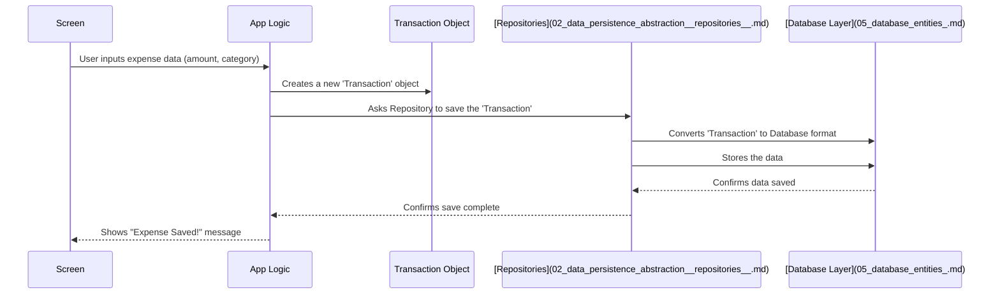

# Chapter 1: Domain Models

Welcome to the `Explained-Final` project tutorial! We're going to break down how this app works, piece by piece, starting with the very basics.

Imagine you're building an app to track your expenses. What are the essential *things* or concepts you need to keep track of? You'd probably need:

*   The **Transaction** itself (how much money, when, what for).
*   The **Category** of the spending (like "Food", "Transport", "Bills").
*   Maybe the **Currency** (like USD, EUR, JPY).

In software development, especially in projects like `Explained-Final`, we call these core concepts **Domain Models**.

## What are Domain Models?

Think of Domain Models as simple **blueprints** for the essential information your application works with. They are the "nouns" of your app. Just like a blueprint for a house defines what a "Room" is (it has walls, a floor, maybe windows), a Domain Model defines what a "Transaction" is.

In `Explained-Final`, our Domain Models include:

*   `Transaction`: Represents a single income or expense record.
*   `Category`: Defines the type of transaction (e.g., Food, Shopping).
*   `Currency`: Represents the currency used (though simplified in this project).
*   `ChatGroup`: Represents a conversation thread with the AI.
*   `ChatMessage`: Represents a single message within a chat.

These models define *what* information belongs to each concept. For example, a `Transaction` blueprint specifies that it needs to have an amount, a date, a category, and so on.

Crucially, these blueprints are **platform-agnostic**. This means the definition of a `Transaction` is the same whether the app is running on Android, iOS, or any other platform. They are written in pure Kotlin and live in the `commonMain` source set, shared across all platforms.

## Example: The `Transaction` Blueprint

Let's look at a simplified version of the blueprint for a `Transaction` in our project. It's defined using a Kotlin `data class`, which is perfect for holding data.

```kotlin
// Defines the structure for a Transaction
// Found in: composeApp/src/commonMain/kotlin/com/harissabil/damome/domain/model/Transaction.kt

data class Transaction(
    val id: Long?, // A unique number once saved (null if new)
    val type: TransactionType, // Is it Income or Expense?
    val timestamp: Instant, // When did it happen?
    val amount: Double, // How much money?
    val currency: Currency, // Which currency? (This is another Domain Model!)
    val category: String, // What category? e.g., "foods", "bills"
    val description: String?, // Optional notes like "Lunch with coworkers"
    // ... other fields exist for advanced features ...
)

// Defines the possible types for a Transaction
enum class TransactionType(val value: String) {
    INCOME("income"),
    EXPENSE("expense")
}
```

*   **`data class Transaction`**: This line declares our blueprint named `Transaction`.
*   **`val id: Long?`**: This holds a unique ID number for the transaction, like a serial number. It's `Long?` (nullable Long) because a new transaction might not have an ID until it's saved.
*   **`val type: TransactionType`**: Tells us if money came in (`INCOME`) or went out (`EXPENSE`). `TransactionType` is another small blueprint (an `enum`) defining these specific options.
*   **`val timestamp: Instant`**: Records the exact date and time of the transaction.
*   **`val amount: Double`**: The amount of money involved.
*   **`val currency: Currency`**: Specifies the currency (e.g., USD). Notice this itself refers to another Domain Model, `Currency`.
*   **`val category: String`**: A text value representing the category (like "shopping"). We often link this to the `Category` enum shown next.
*   **`val description: String?`**: Optional text for more details. It's `String?` because it might be empty.

This `Transaction` class doesn't *do* much by itself; it mainly just *holds* the data in a structured way.

## Example: The `Category` Blueprint

Categories are handled a bit differently. Since we have a fixed set of categories (Food, Bills, etc.), we use a Kotlin `enum`.

```kotlin
// Defines the available categories
// Found in: composeApp/src/commonMain/kotlin/com/harissabil/damome/domain/model/Category.kt

enum class Category(
    val value: String, // Internal ID (e.g., "foods")
    val display: String, // Name shown to user (e.g., "Foods")
    val icon: ImageVector, // Icon for the UI
    val color: Color, // Color for the UI
) {
    // Each category is defined here
    FOODS("foods", "Foods", /*...icon...*/, /*...color...*/),
    SHOPPING("shopping", "Shopping", /*...icon...*/, /*...color...*/),
    // ... many other categories ...
    OTHERS("others", "Others", /*...icon...*/, /*...color...*/);

    // Helper function to find a Category based on its 'value'
    companion object {
        fun String.toCategory(): Category { /* ... */ }
    }
}
```

*   **`enum class Category`**: Declares a fixed set of possible categories.
*   **`FOODS(...)`, `SHOPPING(...)`**: Each item represents one specific category with its properties:
    *   `value`: A simple text ID used internally.
    *   `display`: The user-friendly name shown on the screen.
    *   `icon`, `color`: Visual elements for the user interface.

## Why Bother With These Blueprints?

These Domain Models are the **common language** for data within the app.

1.  **Consistency:** Everywhere in the code that needs to deal with a transaction, it uses the *exact same* `Transaction` structure. No confusion about what data is available.
2.  **Decoupling:** The screen showing the transaction list doesn't need to know *how* the transaction was saved to the database. It just receives a `Transaction` object. The database part doesn't need to know *how* the transaction will be displayed; it just provides a `Transaction` object.
3.  **Reusability:** Since they are in `commonMain`, the same `Transaction`, `Category`, etc., definitions are used for Android, iOS, Desktop, or any other platform the app might support in the future.

## How Domain Models Flow Through the App

Imagine adding a new expense:

1.  You type details into the app's screen (UI).
2.  The app takes this input and creates a `Transaction` object (our blueprint filled with data).
3.  This `Transaction` object might be passed to some background logic.
4.  If you want to save it, this `Transaction` object is handed over to something called a [Data Persistence Abstraction (Repositories)](02_data_persistence_abstraction__repositories__.md).
5.  The Repository might need to convert the `Transaction` object into a slightly different format suitable for storing in a database (these formats are called [Database Entities](05_database_entities_.md)).
6.  When you later want to view your expenses, the process reverses: the database gives back its format, the Repository converts it back into a `Transaction` object, and this object is sent to the UI to be displayed.

Here's a simplified view of that flow:



The `Transaction` object acts like a standardized container carrying the necessary information between different parts of the app (UI, Logic, Repository).

## Where to Find Them

All these core blueprints (Domain Models) live inside the `composeApp/src/commonMain/kotlin/com/harissabil/damome/domain/model/` directory in the project's code. You'll see files like `Transaction.kt`, `Category.kt`, `ChatGroup.kt`, etc. They are typically simple `data class` or `enum` definitions.

## Conclusion

You've just learned about Domain Models – the fundamental data blueprints (`Transaction`, `Category`, etc.) of the `Explained-Final` application.

*   They define the **structure** of the core concepts.
*   They act as a **common language** for data across the app.
*   They are **platform-agnostic**, defined in `commonMain`.
*   They are typically simple Kotlin `data class` or `enum` files.

Now that we understand *what* data we're working with (the Domain Models), the next logical step is to figure out *how* we save this data so it doesn't disappear when the app closes, and how we load it back later. This is handled by a concept called Repositories.

Let's move on to the next chapter: [Data Persistence Abstraction (Repositories)](02_data_persistence_abstraction__repositories__.md).

---

Generated by [AI Codebase Knowledge Builder](https://github.com/The-Pocket/Tutorial-Codebase-Knowledge)