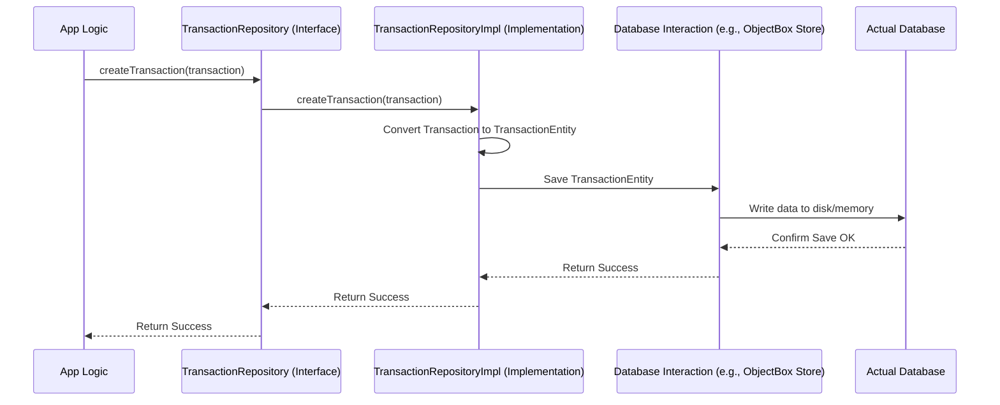

# Chapter 2: Data Persistence Abstraction (Repositories)

In the [previous chapter](01_domain_models_.md), we learned about **Domain Models** like `Transaction` – the blueprints for the data our app uses. That's great, but how do we actually *save* this data so it isn't lost when the user closes the app? And how do we get it back later?

Imagine you write down an expense on a sticky note (`Transaction` object). If you throw the note away, the information is gone! We need a reliable place to store these notes and a system to retrieve them. This is where **Repositories** come in.

## The Problem: Mixing Logic with Storage Details

Think about saving a new expense. You have the `Transaction` object ready. Where does it go?

*   Should the screen itself know exactly how to write data into a database file?
*   What if we want to change the database technology later (e.g., move from saving in simple files to a more powerful database)? We'd have to rewrite code all over the app!

This mixing of *what* data to save (the `Transaction` object) with *how* to save it (the specific database commands) makes the code messy, hard to change, and difficult to test.

## The Solution: The Repository (Our Librarian)

A **Repository** acts like a helpful librarian for our app's data.

*   **You (App Logic):** You need to save a new `Transaction` (like wanting to return a book) or find all existing transactions (like wanting to borrow books on a certain topic).
*   **Repository (Librarian):** You simply tell the librarian what you need ("Save this transaction," "Get all transactions"). The librarian handles the details of *how* to store it (which shelf, which filing system) or *how* to find it.

Crucially, **you don't need to know or care about the library's internal storage system.** You just interact with the librarian through a clear set of requests (a defined API).

In `Explained-Final`, Repositories act as mediators between the app's business logic (like in [ViewModels](03_viewmodels_.md)) and the actual data storage mechanism (like the [Database Entities](05_database_entities_.md) and the [Platform-Specific Database Implementation (ObjectBox/Room)](06_platform_specific_database_implementation__objectbox_room__.md)).

## The Repository Contract: The Interface

How do we ensure our app logic knows *how* to talk to the "librarian"? We use a Kotlin `interface`. An interface is like a **contract** or a list of promises. It defines *what* functions the Repository must provide, without specifying *how* they actually work internally.

Here's a simplified look at the contract for managing transactions:

```kotlin
// Defines the "requests" we can make regarding Transactions
// Found in: composeApp/src/commonMain/kotlin/com/harissabil/damome/domain/repository/TransactionRepository.kt

interface TransactionRepository {

    // Promise: "I can save a new transaction for you."
    suspend fun createTransaction(transaction: Transaction): Result<Unit>

    // Promise: "I can give you a list of all transactions, updated live."
    fun getAllTransactions(): Flow<List<Transaction>>

    // Promise: "I can update an existing transaction."
    suspend fun updateTransaction(transaction: Transaction): Result<Unit>

    // Promise: "I can delete a specific transaction."
    suspend fun deleteTransaction(transaction: Transaction)

    // ... other possible requests exist ...
}
```

*   **`interface TransactionRepository`**: Declares the contract.
*   **`createTransaction(transaction: Transaction)`**: A function that takes a `Transaction` object (our Domain Model) and promises to save it. The `suspend` keyword means this might take some time (like waiting for the database) and shouldn't block the main app thread. `Result<Unit>` indicates whether the save succeeded or failed.
*   **`getAllTransactions(): Flow<List<Transaction>>`**: A function that promises to provide a list of all `Transaction` objects. The `Flow` part means it's like a stream – if new transactions are added or changed in the database, this stream will automatically emit the updated list.
*   **`updateTransaction(...)`**, **`deleteTransaction(...)`**: Similar promises for modifying or removing data.

The rest of the app, like the screens or [ViewModels](03_viewmodels_.md), will only ever refer to `TransactionRepository` (the interface/contract), not the specific implementation details.

## Using the Repository: Making Requests

Let's say our app logic (maybe inside a [ViewModel](03_viewmodels_.md)) needs to save a new expense. It would have access to an object that fulfills the `TransactionRepository` contract, and it would simply call the function:

```kotlin
// Somewhere in our app's logic...
// (We assume 'myTransactionRepository' is an object that implements TransactionRepository)
// (We assume 'newExpense' is a Transaction object created from user input)

suspend fun saveNewExpense(newExpense: Transaction) {
    val result = myTransactionRepository.createTransaction(newExpense)
    if (result is Result.Success) {
        println("Expense saved successfully!")
    } else {
        println("Oops, failed to save expense.")
    }
}
```

And if it needs to display all transactions:

```kotlin
// Somewhere in our app's logic...

fun observeAllExpenses() {
    // Get the Flow (stream) of transactions
    val transactionFlow: Flow<List<Transaction>> = myTransactionRepository.getAllTransactions()

    // Listen to the stream for updates
    // (Specific UI code would go here to display the list)
    transactionFlow.collect { transactions ->
        println("Current transactions: $transactions")
        // Update the screen with this list
    }
}
```

Notice how simple this is! The logic just calls the methods defined in the interface. It doesn't know or care if the data is being saved in ObjectBox, Room, or even a cloud service.

## How It Works Under the Hood: The Implementation

The `interface` is just the contract. Someone needs to actually *do* the work – the real librarian needs to manage the shelves. This is the **implementation** class.

In `Explained-Final`, we have classes like `TransactionRepositoryImpl` that *implement* the `TransactionRepository` interface. This implementation class *does* know about the specific database details.

Here's a simplified step-by-step of what happens when `createTransaction` is called:

1.  **App Logic:** Calls `createTransaction(myExpense)` on the `TransactionRepository` interface.
2.  **Repository Implementation (`TransactionRepositoryImpl`):** Receives the `Transaction` object (the Domain Model).
3.  **Conversion:** The implementation knows it needs to store this in the database. Databases often require data in a slightly different format (an "Entity"). So, it converts the `Transaction` object into a `TransactionEntity` object (more on this in the [Database Entities](05_database_entities_.md) chapter).
4.  **Database Interaction:** The implementation uses a specific database tool (like ObjectBox, covered in [Platform-Specific Database Implementation (ObjectBox/Room)](06_platform_specific_database_implementation__objectbox_room__.md)) to save the `TransactionEntity` into the actual database.
5.  **Result:** The database confirms success or failure, and the implementation reports this back to the App Logic.

Let's visualize this flow:



Now, let's peek at a simplified version of the implementation code:

```kotlin
// The actual implementation that talks to the database
// Found in: composeApp/.../data/local/repository/TransactionRepositoryImpl.kt

class TransactionRepositoryImpl(
    // Dependency: Knows how to talk to the specific DB (e.g., ObjectBox)
    private val transactionLocalStore: TransactionLocalStore,
    // Dependency: Knows how to convert Domain Model -> DB Entity
    private val entityDataSource: (Transaction) -> TransactionObject
) : TransactionRepository { // It promises to fulfill the contract

    override suspend fun createTransaction(transaction: Transaction): Result<Unit> {
        try {
            // 1. Convert Domain Model to Database Entity format
            val dbEntity = entityDataSource(transaction)
            // 2. Tell the database store to save the entity
            transactionLocalStore.put(dbEntity)
            return Result.Success(Unit) // Report success
        } catch (e: Exception) {
            return Result.Error("Failed to save") // Report error
        }
    }

    override fun getAllTransactions(): Flow<List<Transaction>> {
        // 1. Ask the DB store for all relevant entities (as a Flow)
        return transactionLocalStore.all()
            .map { listOfDbEntities ->
                // 2. Convert each DB Entity back to a Domain Model
                listOfDbEntities.map { it.toTransaction() }
            }
    }
    // ... implementations for update, delete, etc. ...
}
```

*   **`class TransactionRepositoryImpl(...) : TransactionRepository`**: This class *implements* the `TransactionRepository` interface, meaning it provides actual code for all the functions promised in the contract.
*   **`transactionLocalStore`**: This is an object specifically designed to interact with the chosen database technology (like ObjectBox). It handles the low-level saving and loading. We'll learn more about this in the [Platform-Specific Database Implementation](06_platform_specific_database_implementation__objectbox_room__.md) chapter.
*   **`entityDataSource`**: This is a helper function that knows how to convert a `Transaction` (Domain Model) into the format the database needs (`TransactionEntity`). We'll cover entities in the [Database Entities](05_database_entities_.md) chapter.
*   **`createTransaction` Implementation**: It converts the incoming `Transaction` to the database format (`dbEntity`) and asks the `transactionLocalStore` to save it.
*   **`getAllTransactions` Implementation**: It asks the `transactionLocalStore` for all saved items (which come back as database entities) and then uses a mapping function (`.map { it.toTransaction() }`) to convert them back into the `Transaction` Domain Models that the rest of the app expects.

*(Don't worry too much about `Result`, `Flow`, `suspend`, or how `transactionLocalStore` and `entityDataSource` are provided yet. We'll cover `Flow` more with [ViewModels](03_viewmodels_.md) and the dependencies with [Koin Dependency Injection Setup](08_koin_dependency_injection_setup_.md).)*

## Why Is This Abstraction So Useful?

Using the Repository pattern gives us several advantages:

1.  **Separation of Concerns:** The app's main logic (how screens work, business rules) is completely separate from the data storage details.
2.  **Testability:** When testing the app logic, we can provide a *fake* `TransactionRepository` that just stores data in memory, without needing a real database. This makes tests faster and more reliable.
3.  **Flexibility:** If we wanted to switch from using the ObjectBox database to another database like Room, we would only need to change the `TransactionRepositoryImpl` (and related database code like `TransactionLocalStore` and `TransactionEntity`). The rest of the app logic using the `TransactionRepository` interface wouldn't need to change at all! This is explored more in [Platform-Specific Database Implementation (ObjectBox/Room)](06_platform_specific_database_implementation__objectbox_room__.md).
4.  **Single Source of Truth:** Repositories often become the single point of access for a specific type of data, ensuring consistency.

## Conclusion

You've now learned about **Repositories**, the crucial abstraction layer that handles data persistence in `Explained-Final`.

*   They act as **mediators** (like librarians) between your app logic and the actual data storage.
*   They expose a clean **interface** (a contract) defining *what* data operations are possible (Create, Read, Update, Delete).
*   The app logic interacts **only with the interface**, unaware of the underlying database implementation.
*   The **implementation** class handles the specific database interactions and conversions between [Domain Models](01_domain_models_.md) and [Database Entities](05_database_entities_.md).
*   This pattern makes the app more **organized, testable, and flexible**.

We now understand our data blueprints ([Domain Models](01_domain_models_.md)) and how we save/load them ([Repositories](02_data_persistence_abstraction__repositories__.md)). But how does the user interface (UI) actually use this? How does the app manage the state displayed on the screen and handle user interactions that trigger these repository operations? That's the job of the ViewModel.

Let's move on to the next chapter: [ViewModels](03_viewmodels_.md).

---

Generated by [AI Codebase Knowledge Builder](https://github.com/The-Pocket/Tutorial-Codebase-Knowledge)