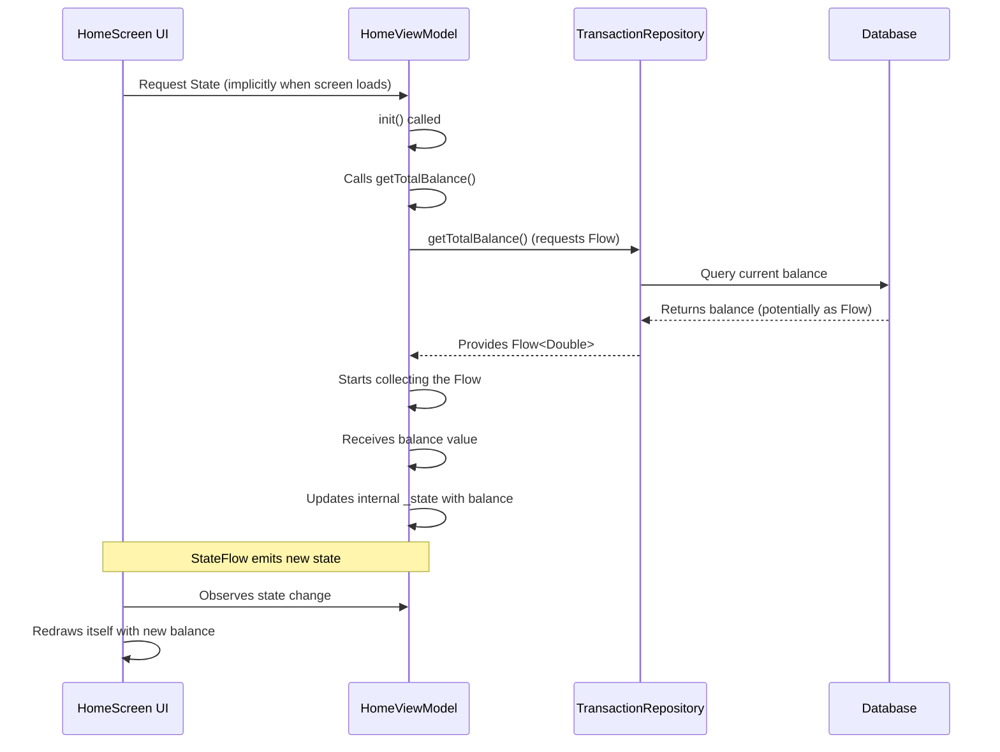

# Chapter 3: ViewModels

In the [previous chapter](02_data_persistence_abstraction__repositories__.md), we learned how **Repositories** act like librarians, managing the saving and loading of our app's data, like `Transaction` objects. They provide a clean way to talk to the data storage without knowing the messy details.

But how does our *screen* (the User Interface or UI) actually get the data it needs to display? For example, how does the home screen know the current total balance? And when you tap a "Save Expense" button, what coordinates the process of taking your input, telling the [Repository](02_data_persistence_abstraction__repositories__.md) to save it, and then updating the screen?

This is where **ViewModels** come in.

## The Problem: Cluttered Screens

Imagine if the code for the home screen *itself* had to:

1.  Directly talk to the database to get the balance.
2.  Keep track of whether data is currently loading.
3.  Handle the logic for what happens when you click the "Add Transaction" button.
4.  Format the balance correctly according to the user's currency.

The screen code would become very complex and hard to manage! It would mix the *what* to display (buttons, text) with the *how* to get the data and *what* to do when the user interacts. If we changed how data is fetched, we'd have to change the screen code directly.

## The Solution: The ViewModel (The Screen's Manager)

Think of a **ViewModel** as the dedicated **manager** or **personal assistant** for a specific screen (like the Home screen) or a major UI component.

Its main jobs are:

1.  **Holding and Managing UI State:** It keeps track of the data the screen needs to display (e.g., the list of recent transactions, the total balance, whether a loading spinner should be shown).
2.  **Preparing Data for the UI:** It gets raw data from [Repositories](02_data_persistence_abstraction__repositories__.md) (like a list of `Transaction` objects) and might format it slightly for easier display (though heavy formatting often happens in the UI itself).
3.  **Handling User Actions:** When the user does something (like clicking a button), the UI tells the ViewModel. The ViewModel then decides what logic to run (e.g., call the Repository to save data, navigate to another screen).
4.  **Communicating with Repositories:** It's the ViewModel's job to ask the appropriate [Repository](02_data_persistence_abstraction__repositories__.md) for data or tell it to save/update/delete data.

Essentially, the ViewModel sits between the UI and the data layer ([Repositories](02_data_persistence_abstraction__repositories__.md)), keeping them separate and organized.

## Key Concepts

*   **UI State:** This is the information the UI needs to draw itself. It's often held in special containers (like `StateFlow` in Kotlin) that the UI can observe. When the data in the state changes, the UI automatically knows to update itself. Our `HomeViewModel` might have a state object containing the `totalBalance`, `totalIncome`, `totalExpense`, etc.
*   **Events/Actions:** These are triggers from the UI, usually caused by user interaction. For example, typing in the description field triggers an "description changed" event, clicking "Save" triggers a "save requested" event.
*   **Logic:** This is the code inside the ViewModel that reacts to events or performs initial setup. For instance, the logic for the "save requested" event would involve creating a `Transaction` object and calling the `transactionRepository.createTransaction` function.

## How ViewModels Work: Displaying the Total Balance

Let's revisit our example: showing the total balance on the home screen.

1.  **UI Needs Data:** The Home screen needs to display the total balance.
2.  **Ask the Manager:** The UI asks its manager, the `HomeViewModel`, for the balance.
3.  **ViewModel Gets Data:** The `HomeViewModel` knows it needs the balance. During its initialization, it asks the `TransactionRepository` for the total balance.
4.  **Repository Provides Data:** The `TransactionRepository` provides the balance, possibly as a `Flow` (a stream of data that updates automatically when the balance changes in the database).
5.  **ViewModel Holds State:** The `HomeViewModel` receives the balance data (and any future updates) from the Repository. It stores this balance in its **UI State**.
6.  **UI Observes State:** The Home screen is set up to "watch" or "observe" the `HomeViewModel`'s UI State. When the balance value in the state changes, the UI automatically redraws the text displaying the balance.

This way, the UI only knows about the ViewModel and its state; it doesn't care *how* the ViewModel got the balance.

## A Look Inside: The `HomeViewModel`

Let's peek at a simplified version of `HomeViewModel`.

```kotlin
// Manages the state and logic for the Home screen
// Found in: composeApp/src/commonMain/kotlin/com/harissabil/damome/ui/screen/home/HomeViewModel.kt

class HomeViewModel(
    // Needs access to the Transaction 'librarian'
    private val transactionRepository: TransactionRepository,
    // ... other dependencies like CurrencyRepository ...
) : ViewModel() { // Inherits from ViewModel base class

    // 1. Private, mutable state holder
    private val _state = MutableStateFlow(HomeState())
    // 2. Public, read-only state for the UI to observe
    val state: StateFlow<HomeState> = _state.asStateFlow()

    // 3. Initialization block (runs when ViewModel is created)
    init {
        getTotalBalance() // Ask for balance immediately
        // ... get other needed data ...
    }

    // 4. Function to fetch the total balance
    private fun getTotalBalance() = viewModelScope.launch {
        // Ask the repository for the balance (Flow)
        transactionRepository.getTotalBalance().collect { balance ->
            // 5. Update the state when new balance arrives
            _state.update { currentState ->
                currentState.copy(totalBalance = balance)
            }
        }
    }

    // --- Functions to handle user actions would go here ---
    // e.g., fun saveTransaction(...) { ... }
    // e.g., fun deleteTransaction(...) { ... }
}
```

Let's break this down:

1.  **`_state = MutableStateFlow(HomeState())`**: This creates a private container (`_state`) to hold the screen's data. `HomeState` is a simple data class holding fields like `totalBalance`, `totalIncome`, etc. `MutableStateFlow` is a special Kotlin type that can hold data and allows it to be updated.
2.  **`state: StateFlow<HomeState> = _state.asStateFlow()`**: This exposes a *read-only* version (`state`) of the data container to the UI. The UI can observe `state` but cannot directly change it. This ensures changes only happen through the ViewModel's logic.
3.  **`init { getTotalBalance() }`**: The `init` block runs automatically when the `HomeViewModel` is first created. Here, we immediately call `getTotalBalance` to start fetching the data.
4.  **`getTotalBalance()`**: This function uses `viewModelScope.launch`. `viewModelScope` is a special tool provided by the `ViewModel` library that manages background tasks safely. If the ViewModel is destroyed (e.g., the user leaves the screen permanently), any ongoing tasks in its `viewModelScope` are automatically cancelled to prevent memory leaks. `launch` starts a background task.
5.  **`transactionRepository.getTotalBalance().collect { ... }`**: This calls the Repository function we saw in the last chapter. Because `getTotalBalance` returns a `Flow` (a stream), `.collect` listens to this stream. Whenever the Repository emits a new balance value (because a transaction was added or deleted), the code inside the curly braces `{ ... }` runs.
6.  **`_state.update { ... }`**: Inside the `collect` block, we update the `_state` with the newly received `balance`. `update` is a safe way to change the state value. Because the UI is observing `state`, it will automatically react to this change and display the new balance.

Here’s a simplified flow of how the ViewModel gets and provides the balance:



## Why Are ViewModels So Important?

1.  **Separation of Concerns:** Keeps UI code clean (just displaying state and sending events) and logic code separate (in the ViewModel).
2.  **State Management:** Provides a structured way to hold and update the data needed by the UI.
3.  **Lifecycle Awareness:** ViewModels are often designed (especially on platforms like Android) to survive configuration changes (like rotating the phone) that would normally destroy and recreate the UI. This means the data (like the fetched balance) doesn't need to be re-fetched unnecessarily.
4.  **Testability:** You can test the ViewModel's logic (e.g., does it correctly calculate something? Does it call the Repository when a button is clicked?) without needing a real UI or a real database. You can give it a fake [Repository](02_data_persistence_abstraction__repositories__.md) for testing.
5.  **Collaboration:** Clear separation makes it easier for different developers to work on the UI and the underlying logic simultaneously.

## Conclusion

You've now learned about **ViewModels**, the managers for your app's screens.

*   They act as the **bridge** between the UI and the data layer ([Repositories](02_data_persistence_abstraction__repositories__.md)).
*   They hold the **UI State** (the data the screen needs to display) using tools like `StateFlow`.
*   They handle **user actions** (events) triggered by the UI.
*   They contain the **logic** for fetching data, preparing it for display, and responding to user input.
*   They use tools like `viewModelScope` to handle background tasks safely.
*   They make the app more **organized, testable, and robust** by separating concerns.

We now understand our data ([Domain Models](01_domain_models_.md)), how to store it ([Repositories](02_data_persistence_abstraction__repositories__.md)), and how to manage the screen's state and logic ([ViewModels](03_viewmodels_.md)). But how do users move between different screens, like from the Home screen to the Add Transaction screen or the Settings screen? That's handled by the Navigation System.

Let's move on to the next chapter: [Navigation System (Routes & NavGraph)](04_navigation_system__routes___navgraph__.md).

---

Generated by [AI Codebase Knowledge Builder](https://github.com/The-Pocket/Tutorial-Codebase-Knowledge)