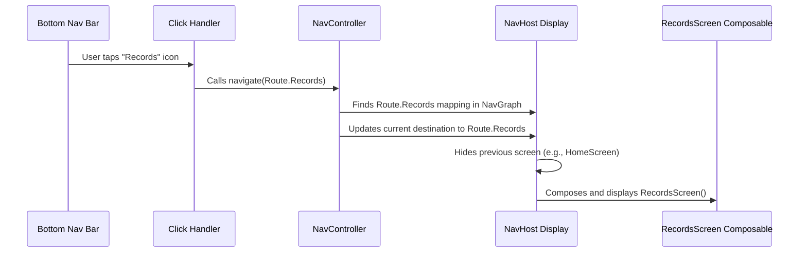

# Chapter 4: Navigation System (Routes & NavGraph)

In the [previous chapter](03_viewmodels_.md), we saw how [ViewModels](03_viewmodels_.md) act as managers for our screens, handling data and logic. They get information from [Repositories](02_data_persistence_abstraction__repositories__.md) and prepare it for the UI.

But a typical app isn't just one screen! Users need to move around – maybe from the main "Home" screen to a "Add New Expense" screen, or to a "Settings" screen. How does the app know which screen to show and how to switch between them smoothly? This is handled by the **Navigation System**.

## The Problem: Getting Lost in the App

Imagine an app without a clear navigation system. Clicking a button might just randomly jump to another screen. Going "back" might lead somewhere unexpected. It would be like trying to find your way around a new city without addresses or a map – confusing and frustrating!

We need a structured way to:

1.  Give each screen a unique "address".
2.  Define the "roads" or paths between these screens.
3.  Have a "GPS" or controller that manages the actual movement between screens.

## The Solution: Routes, NavGraph, and NavController

`Explained-Final` uses a navigation system based on Jetpack Compose Navigation, adapted for Kotlin Multiplatform. Let's break down the key parts using our city analogy:

1.  **`Route` (The Address):** A `Route` is like a unique address for each specific screen or destination in your app. For example, we might have an address for the `HomeScreen`, one for the `RecordsScreen`, and another for the `AddTransactionScreen`. These addresses need to be clear and unambiguous. In our project, we use special Kotlin objects (often within a `sealed class`) along with `kotlinx.serialization` to define these routes in a type-safe way. This means the compiler helps us avoid typos or mistakes when referring to a screen.

2.  **`NavGraph` (The City Map & Roads):** The `NavGraph` is like the overall map of your app's screens. It defines *which* address (`Route`) corresponds to *which* actual screen UI (Composable function). It lays out all the possible destinations and the connections between them. It's essentially the "road network".

3.  **`NavController` (The GPS / Remote Control):** The `NavController` is the component that actually *does* the navigating. You tell it, "Take me to the `RecordsScreen` address (`Route`)", and it uses the `NavGraph` (the map) to figure out how to display that screen. It keeps track of where you've been (the back stack) so the "back" button works correctly.

4.  **`NavHost` (The Display Area):** This is a special Composable function that acts as a container. It listens to the `NavController` and displays the correct screen UI (another Composable) based on the current address (`Route`) the `NavController` points to. Think of it as the window or display where the current location (screen) is shown.

## Defining the Addresses: `Route`

First, we need unique addresses for our screens. We use a Kotlin `sealed class` which is great for defining a restricted set of types. `kotlinx.serialization` helps make these routes robust, especially when we need to pass data between screens (like an ID).

```kotlin
// Defines the possible screen destinations (addresses)
// Found in: composeApp/src/commonMain/kotlin/com/harissabil/damome/ui/navigation/Route.kt

import kotlinx.serialization.Serializable

@Serializable // Makes this usable with navigation libraries
sealed class Route {
    @Serializable
    data object Home : Route() // Address for the Home screen

    @Serializable
    data object Records : Route() // Address for the Records screen

    @Serializable
    data object More : Route() // Address for the More screen

    // Example of a route that needs data (an ID)
    @Serializable
    data class DaMommyChat(val chatGroupId: Long? = null) : Route()
}
```

*   **`@Serializable`**: This annotation tells the Kotlin compiler to generate code that allows these route objects to be easily passed around, essential for the navigation library.
*   **`sealed class Route`**: This declares that `Route` is a special class, and only the types defined *inside* it (`Home`, `Records`, `More`, `DaMommyChat`) are valid `Route`s.
*   **`data object Home : Route()`**: This defines a specific, unique address named `Home`. It's an `object` because there's only one Home screen address.
*   **`data class DaMommyChat(...) : Route()`**: This defines an address for the chat screen. It's a `data class` because it can carry data – in this case, an optional `chatGroupId`. This allows us to navigate to a *specific* chat conversation.

## Creating the Map: `NavGraph` and `NavHost`

Now we need the map (`NavGraph`) that connects these addresses (`Route`) to the actual screen content (Composable functions). This is done within a `NavHost` composable.

```kotlin
// Sets up the navigation map inside a NavHost container
// Simplified from: composeApp/src/commonMain/kotlin/com/harissabil/damome/ui/navigation/NavGraph.kt

import androidx.navigation.compose.* // Navigation library imports
// ... other imports

@Composable
fun NavGraph(/*...parameters like startDestination...*/) {
    // 1. Create the 'GPS' controller
    val navController = rememberNavController()

    // 2. Define the display area and the map
    NavHost(
        navController = navController,
        startDestination = Route.Home // Where to begin?
    ) {
        // 3. Map the 'Home' address to the 'HomeScreen' UI
        composable<Route.Home> {
            HomeScreen(/*...arguments needed by HomeScreen...*/)
        }

        // 4. Map the 'Records' address to the 'RecordsScreen' UI
        composable<Route.Records> {
            RecordsScreen(/*...arguments needed by RecordsScreen...*/)
        }

        // 5. Map the 'DaMommyChat' address (with potential ID)
        composable<Route.DaMommyChat> {
            // Get the arguments passed in the route
            val args = it.toRoute<Route.DaMommyChat>()
            DamommyChatScreen(chatGroupId = args.chatGroupId)
        }

        // ... other composable<Route.SomeScreen> mappings ...
    }

    // (Code for Bottom Navigation Bar using navController would go here)
}
```

1.  **`val navController = rememberNavController()`**: Creates and remembers the navigation controller (our GPS).
2.  **`NavHost(...)`**: This composable is the container that will display the screens.
    *   `navController = navController`: We tell the `NavHost` which controller to listen to.
    *   `startDestination = Route.Home`: We specify the initial address (`Route`) to show when the app starts.
3.  **`composable<Route.Home> { ... }`**: This is the core mapping. It says: "When the `navController` navigates to the `Route.Home` address, execute the code inside the curly braces `{}`". Inside, we call our actual `HomeScreen()` composable function.
4.  **`composable<Route.Records> { ... }`**: Similarly maps the `Route.Records` address to the `RecordsScreen()` composable.
5.  **`composable<Route.DaMommyChat> { ... }`**: Maps the chat route. `it.toRoute<Route.DaMommyChat>()` is a helper provided by the navigation library (thanks to `@Serializable`) to easily extract the arguments (`chatGroupId`) passed with the route.

## Using the GPS: `NavController`

How do we tell the app to actually *go* to a different screen? We use the `NavController`. Typically, this happens in response to a user action, like clicking a button or a navigation bar item.

```kotlin
// Example: Handling a click on a Bottom Navigation Bar item
// Simplified concept from NavGraph.kt bottomBar logic

// Assume 'navController' is available in this scope
// Assume 'index' is the index of the clicked item (0=Home, 1=Records)

fun onNavItemClick(index: Int) {
    when (index) {
        0 -> navController.navigate(Route.Home) // Go to Home address
        1 -> navController.navigate(Route.Records) // Go to Records address
        // ... other cases ...
    }
}

// Example: Navigating to a specific chat from DaMommyScreen
fun onHistoryClick(chatId: Long) {
    // Navigate to the chat address, passing the chatId
    navController.navigate(Route.DaMommyChat(chatGroupId = chatId))
}
```

*   **`navController.navigate(Route.Home)`**: This is the command. We tell the `NavController` to navigate to the specified `Route`.
*   The `NavController` receives this command.
*   It looks up `Route.Home` in the map defined within the `NavHost`.
*   It finds the corresponding `composable` block (`HomeScreen()`).
*   It instructs the `NavHost` to display the `HomeScreen()` UI.

## How It All Connects: The Flow

Let's trace the journey when a user taps the "Records" icon in the bottom navigation bar:



1.  **User Action:** User taps the "Records" icon.
2.  **Event Handler:** The click triggers the `onNavItemClick` function (or similar logic).
3.  **Navigation Command:** The handler calls `navController.navigate(Route.Records)`.
4.  **Controller Acts:** The `NavController` updates its internal state to say the current destination is now `Route.Records`.
5.  **Host Updates:** The `NavHost` observes this change in the `NavController`. It looks up the `composable` associated with `Route.Records`.
6.  **Screen Display:** The `NavHost` removes the old screen and displays the new one by running the `RecordsScreen()` composable function.

## Why Use This System?

*   **Organization:** Keeps screen definitions (`Route`) separate from screen UI (`Composable`) and navigation logic (`NavController`).
*   **Type Safety:** Using `@Serializable` sealed routes prevents errors caused by mistyping screen names. The compiler checks that you're using valid addresses.
*   **Decoupling:** Screens don't need to know about each other directly. They just navigate to abstract `Route` addresses.
*   **Argument Passing:** Easily pass data (like IDs) between screens in a structured and type-safe way.
*   **Back Stack Management:** The `NavController` automatically handles the history of screens visited, making the back button work as expected.

## Conclusion

You've now learned about the **Navigation System** in `Explained-Final`, which allows users to move between screens.

*   **`Route`:** A unique, type-safe address for each screen (e.g., `Route.Home`, `Route.Records`), defined using `@Serializable` sealed classes/objects.
*   **`NavGraph`:** The "map" created inside `NavHost` that links each `Route` address to its corresponding screen UI (`Composable`).
*   **`NavController`:** The "GPS" that manages the current location and handles navigation commands (`navController.navigate(...)`).
*   **`NavHost`:** The container that displays the screen UI associated with the `NavController`'s current `Route`.
*   This system provides an organized, type-safe, and flexible way to manage user flow within the app.

We've covered the core building blocks: data blueprints ([Domain Models](01_domain_models_.md)), data storage access ([Repositories](02_data_persistence_abstraction__repositories__.md)), screen logic ([ViewModels](03_viewmodels_.md)), and moving between screens (Navigation). Now, let's dive deeper into how the data is actually structured *before* it gets saved by the Repositories – the format the database prefers.

Let's move on to the next chapter: [Database Entities](05_database_entities_.md).

---

Generated by [AI Codebase Knowledge Builder](https://github.com/The-Pocket/Tutorial-Codebase-Knowledge)