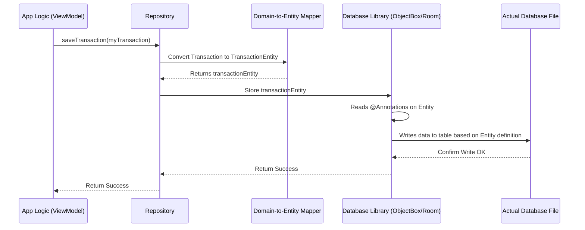

# Chapter 5: Database Entities

In the [previous chapter](04_navigation_system__routes___navgraph__.md), we learned how the app uses `Routes` and a `NavGraph` to navigate between different screens. We know how to get around the app, but let's focus back on the data itself.

We already discussed [Domain Models](01_domain_models_.md) like `Transaction` – the basic blueprints for our data. We also saw how [Repositories](02_data_persistence_abstraction__repositories__.md) act as librarians to save and load this data. But when the librarian goes to put a book (our data) on the shelf (the database), they don't just toss it anywhere. They use a detailed filing system, maybe specific index cards, that describe *exactly* how and where that book is stored. **Database Entities** are like those detailed index cards for our data.

## The Problem: Databases Need Specific Instructions

Our `Transaction` [Domain Model](01_domain_models_.md) is a simple Kotlin `data class`. It's great for passing data around the app, but the database needs more specific instructions. It needs to know:

*   Which piece of data is the unique identifier (like a library card number)?
*   What should the table in the database be called?
*   Are there any special relationships between different pieces of data (like linking a transaction to a specific chat message)?
*   How should complex data types (like dates or custom objects) be stored?

The simple [Domain Model](01_domain_models_.md) doesn't contain this database-specific information.

## The Solution: Database Entities (The Detailed Index Cards)

A **Database Entity** is a class that defines the precise structure of our data *as it will be stored in the database*. It often looks very similar to its corresponding [Domain Model](01_domain_models_.md), but it includes extra annotations (special markers starting with `@`) that provide instructions for the database system.

Think of it like this:

*   **[Domain Model](01_domain_models_.md) (`Transaction`):** A general description of a transaction (amount, date, category). Like saying "It's a book about finances".
*   **Database Entity (`TransactionEntity`):** A detailed index card specifying:
    *   Shelf Location: Database Table "Transactions"
    *   Unique ID: Field "id" (Primary Key)
    *   Date Storage Format: Convert the `Instant` to a simple number (Long)
    *   Special Indexing: Create an index on the "timestamp" field for faster searching.

These entities tell the database tool (like ObjectBox on Android or Room on Desktop) exactly how to create the database tables and store the data efficiently.

## Key Concepts

1.  **Entities:** These are Kotlin classes (usually `data class`) representing a table in your database. Each instance of the class corresponds to a row in that table.
2.  **Annotations (`@Entity`, `@Id`, `@PrimaryKey`, etc.):** These are special markers added to the entity class and its properties. They act as metadata, providing instructions to the database library on how to handle the data.
    *   `@Entity`: Marks the class as a database table definition.
    *   `@Id` (ObjectBox) or `@PrimaryKey` (Room): Identifies the unique ID field for each record.
    *   `@Index` (ObjectBox) or `@ColumnInfo(index = true)` (Room): Tells the database to create an index on this field to speed up searches.
    *   `@Convert` (ObjectBox) or `@TypeConverters` (Room): Specifies how to convert complex Kotlin types (like `Instant` or `Currency`) into simple types the database understands (like `Long` or `String`).
    *   `@Relation` (ObjectBox) or `@Relation` (Room): Defines relationships between different entities (e.g., linking a `ChatMessageEntity` to its `TransactionEntity` list).
3.  **Platform Differences:** Because `Explained-Final` uses different database libraries for Android (ObjectBox) and Desktop (Room), the *exact* annotations and sometimes the structure of the entities differ slightly between `androidMain` and `desktopMain` source sets. However, the underlying *purpose* is the same: define the database schema.

## Using Entities: From Domain Model to Database Format

Let's see how a `Transaction` [Domain Model](01_domain_models_.md) gets translated into a `TransactionEntity` before being saved.

Imagine our app logic (inside a [ViewModel](03_viewmodels_.md)) asks the [Repository](02_data_persistence_abstraction__repositories__.md) to save this `Transaction`:

```kotlin
// Our simple Domain Model
// From: composeApp/src/commonMain/kotlin/.../domain/model/Transaction.kt
data class Transaction(
    val id: Long?,
    val type: TransactionType,
    val timestamp: Instant, // Complex Kotlin type
    val amount: Double,
    val currency: Currency, // Custom enum class
    val category: String,
    val description: String?
    // ... other fields ...
)
```

The [Repository](02_data_persistence_abstraction__repositories__.md) needs to convert this into a format the database understands. Let's look at the ObjectBox (Android) version:

```kotlin
// The detailed 'index card' for ObjectBox (Android)
// From: composeApp/src/androidMain/kotlin/.../entity/TransactionEntity.kt

@Entity // Mark this as a database table blueprint
data class TransactionEntity(
    @Id // Mark 'id' as the unique primary key
    override var id: Long? = 0,

    @Index // Index 'type' for faster queries
    override var type: String, // Stored as simple String

    @Convert(converter = TimestampConverter::class, dbType = Long::class)
    override var timestamp: Instant, // Still Instant, but DB stores as Long

    override var amount: Double,

    @Convert(converter = CurrencyConverter::class, dbType = String::class)
    override var currency: Currency, // Still Currency, but DB stores as String

    override var category: String,
    override var description: String? = null,
    // ... other DB-specific fields like embedding ...
) : ITransactionEntity // Implements a common interface
```

**Key Differences:**

*   **Annotations:** `TransactionEntity` has `@Entity`, `@Id`, `@Index`, `@Convert`. These tell ObjectBox how to manage this data.
*   **Type Conversion:** Annotations like `@Convert` handle the conversion of `Instant` and `Currency` into basic types (`Long`, `String`) that ObjectBox can store directly. The `TransactionEntity` class itself still holds the original types (`Instant`, `Currency`) for convenience when mapping back, but the annotation tells ObjectBox how to persist it.
*   **Inheritance:** It implements `ITransactionEntity`. This is an interface defined in `commonMain` that ensures both the Android and Desktop entities share a common set of properties, even if the annotations differ.

## How It Works Under the Hood: The Conversion Step

When the [Repository](02_data_persistence_abstraction__repositories__.md) needs to save data:

1.  **Receive Domain Model:** The Repository's `createTransaction` method receives the `Transaction` (Domain Model) object.
2.  **Convert to Entity:** Inside the Repository implementation, a helper function (often called a mapper) converts the `Transaction` object into a `TransactionEntity` object. This involves copying the data and ensuring it matches the structure defined by the entity.
3.  **Pass Entity to Database Layer:** The Repository passes the newly created `TransactionEntity` object to the specific database interaction layer (e.g., the ObjectBox `BoxStore` or Room `Dao`).
4.  **Database Stores Data:** The database library reads the annotations (`@Entity`, `@Id`, etc.) on the `TransactionEntity` and uses that information to store the data correctly in the underlying database file or memory.

Here's a simplified view of that flow:



The key step here is the conversion handled by the "Mapper", translating the app's general data blueprint ([Domain Model](01_domain_models_.md)) into the database's specific blueprint (Entity).

## A Look at the Code: Entities in Action

Let's look again at the key annotations for both platforms.

**ObjectBox (Android):**

```kotlin
// From: composeApp/src/androidMain/kotlin/.../entity/TransactionEntity.kt
@Entity // Blueprint for a database table
data class TransactionEntity(
    @Id // Unique identifier for this record
    override var id: Long? = 0,
    @Index // Helps find records faster by 'type'
    override var type: String,
    @Convert(converter = TimestampConverter::class, dbType = Long::class)
    override var timestamp: Instant, // Use TimestampConverter to save as Long
    // ... other fields ...
) : ITransactionEntity // Common structure
```

*   `@Entity`: Tells ObjectBox this class defines a database table.
*   `@Id`: Marks `id` as the primary key. ObjectBox can auto-generate this.
*   `@Index`: Speeds up queries filtering by `type`.
*   `@Convert`: Uses a separate `TimestampConverter` class to turn the `Instant` into a `Long` for storage and back again when reading.

**Room (Desktop):**

```kotlin
// From: composeApp/src/desktopMain/kotlin/.../entity/TransactionEntity.kt
@Entity // Blueprint for a database table
data class TransactionEntity(
    @PrimaryKey(autoGenerate = true) // Unique ID, auto-generated by Room
    override var id: Long? = 0,
    override var type: String, // Stored as String (TEXT in SQLite)
    override var timestamp: Instant, // Room needs a @TypeConverter defined elsewhere
    override var amount: Double, // Stored as REAL
    override var currency: Currency, // Needs a @TypeConverter
    override var category: String,
    override var description: String? = null,
    @ColumnInfo(name = "text_to_embed") // Custom column name
    override var textToEmbed: String? = null,
    // ... embedding field (may need @TypeConverter) ...
) : ITransactionEntity // Common structure
```

*   `@Entity`: Tells Room this class defines a database table (often an SQLite table).
*   `@PrimaryKey(autoGenerate = true)`: Marks `id` as the primary key and tells Room to automatically generate values for new entries.
*   `@ColumnInfo`: Allows specifying details about the column, like its name in the database (`text_to_embed`). Room often needs separate `@TypeConverters` defined for complex types like `Instant` or `Currency`.

**The Common Interface:**

Notice both `TransactionEntity` classes implement `ITransactionEntity`:

```kotlin
// The shared contract for Transaction Entities across platforms
// From: composeApp/src/commonMain/kotlin/.../entity/ITransactionEntity.kt
interface ITransactionEntity {
    var id: Long?
    var type: String
    var timestamp: Instant
    var amount: Double
    var currency: Currency
    var category: String
    var description: String?
    // ... other common fields ...
}
```

This interface, defined in `commonMain`, ensures that regardless of the platform-specific annotations, the core *data fields* expected by the [Repository](02_data_persistence_abstraction__repositories__.md)'s mapping logic are present.

## Why Do We Need This Extra Step?

Using Database Entities provides several benefits:

1.  **Defines Schema:** They are the source of truth for the database structure (tables, columns, types).
2.  **Database Features:** Allows leveraging database-specific features like indexing, relationships, constraints, and type conversion using annotations.
3.  **Decoupling:** Keeps the [Domain Models](01_domain_models_.md) clean and independent of database details. The rest of the app doesn't need to know about `@Id` or `@Convert`.
4.  **Platform Adaptation:** Allows using different database libraries (ObjectBox, Room) on different platforms while maintaining a similar overall data structure concept, often unified by common interfaces (`ITransactionEntity`).

## Conclusion

You've now learned about **Database Entities** – the detailed blueprints that define how our app's data is structured *within the database*.

*   They are Kotlin classes, often similar to [Domain Models](01_domain_models_.md), but decorated with **database-specific annotations** (`@Entity`, `@Id`, `@Convert`, `@PrimaryKey`, etc.).
*   These annotations instruct the database library (ObjectBox or Room) on **how to create tables and store data**.
*   They allow us to use **database features** like indexing and relationships.
*   They exist separately for Android (ObjectBox) and Desktop (Room) due to different library requirements, but often implement a **common interface** (`ITransactionEntity`) defined in `commonMain`.
*   They **decouple** the app's core data structures ([Domain Models](01_domain_models_.md)) from the specifics of data persistence.

Now that we understand the blueprints (`Entities`) used by the database, let's see how the actual database libraries (ObjectBox and Room) use these entities to perform the real work of saving, loading, and managing data on each platform.

Let's move on to the next chapter: [Platform-Specific Database Implementation (ObjectBox/Room)](06_platform_specific_database_implementation__objectbox_room__.md).

---

Generated by [AI Codebase Knowledge Builder](https://github.com/The-Pocket/Tutorial-Codebase-Knowledge)