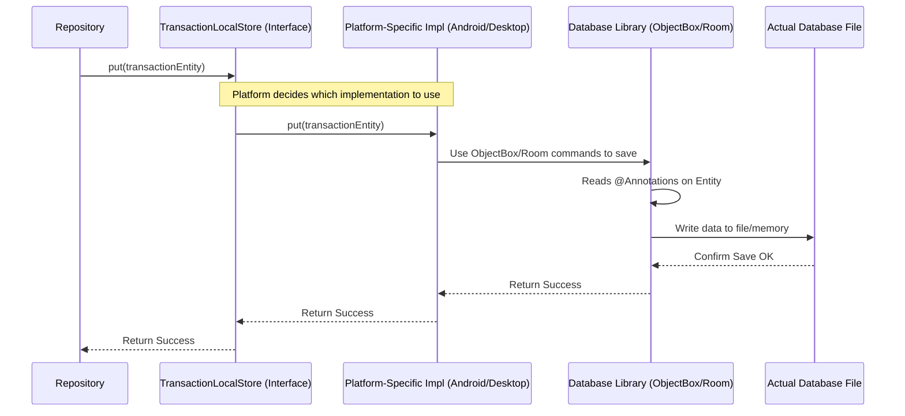

# Chapter 6: Platform-Specific Database Implementation (ObjectBox/Room)

In the [previous chapter](05_database_entities_.md), we learned about **Database Entities** – the detailed "index cards" like `TransactionEntity` that tell the database *exactly* how our data should be structured for storage. We know the format, but who actually takes this card and files it away? And how does this filing happen differently if we're using an Android phone versus a Desktop computer?

This chapter focuses on the *actual workers* that interact with the database on each specific platform (Android and Desktop), using the database tools chosen for that platform: **ObjectBox** for Android and **Room** for Desktop.

## The Problem: Different Tools for Different Platforms

Imagine our app is like a library service operating in two cities.
*   **City A (Android):** Uses a modern, super-fast digital catalog system (like **ObjectBox**).
*   **City B (Desktop):** Uses a well-established, reliable physical card catalog system (like **Room**, which often uses a system called SQLite underneath).

Our main librarian ([Repositories](02_data_persistence_abstraction__repositories__.md)) needs to be able to manage books (data) in *both* cities. Does the librarian need to learn the intricate details of both the digital system *and* the physical card system? That sounds complicated and inefficient!

We need a way for the librarian to use the *same* set of commands ("Save this book", "Find books by author") regardless of which city's library system they are interacting with.

## The Solution: Common Interfaces, Specific Implementations

This is where the magic of abstraction comes in again!

1.  **Common Interfaces (`*LocalStore`, `*Dao`):** We define a standard set of commands (a contract or interface) in our shared code (`commonMain`). This is like creating a universal "Librarian's Manual" that works for both cities. Examples in our code are `TransactionLocalStore`, `CurrencyLocalStore`, and `ChatLocalStore`. These interfaces define *what* database operations are needed (e.g., `put`, `all`, `findTransactionByDate`).

2.  **Platform-Specific Implementations:**
    *   **Android (`androidMain`):** We create classes that *implement* these common interfaces using the **ObjectBox** library. This is like the detailed chapter in the manual explaining how to use the digital catalog system. Example: `TransactionLocalStoreAndroid`.
    *   **Desktop (`desktopMain`):** We create classes that *implement* the same common interfaces, but this time using the **Room** library (and its `Dao` interfaces). This is the chapter explaining how to use the physical card catalog. Example: `TransactionLocalStoreDesktop`.

The [Repository](02_data_persistence_abstraction__repositories__.md) (our main librarian) only ever talks to the **common interface**. It doesn't know or care whether it's ObjectBox or Room doing the actual work behind the scenes.

## How It Works: The Repository Delegates the Work

Let's trace how saving a transaction works:

1.  **App Logic:** The [ViewModel](03_viewmodels_.md) asks the `TransactionRepository` to save a `Transaction`.
2.  **Repository:** The `TransactionRepositoryImpl` receives the `Transaction` [Domain Model](01_domain_models_.md).
3.  **Mapping:** It converts the `Transaction` into the appropriate `TransactionEntity` (as we saw in [Chapter 5](05_database_entities_.md)).
4.  **Delegation:** The Repository *doesn't* talk directly to ObjectBox or Room. Instead, it talks to the **`TransactionLocalStore` interface**. It calls a method like `transactionLocalStore.put(transactionEntity)`.
5.  **Platform Switch:** Depending on whether the app is running on Android or Desktop, the system automatically uses *either* `TransactionLocalStoreAndroid` or `TransactionLocalStoreDesktop` to handle the `put` command.
    *   **On Android:** `TransactionLocalStoreAndroid` takes the `TransactionEntity` and uses ObjectBox commands (`ObjectBox.store.boxFor(...).put(...)`) to save it to the ObjectBox database.
    *   **On Desktop:** `TransactionLocalStoreDesktop` takes the `TransactionEntity` and tells its Room `TransactionDao` (`transactionDao.put(...)`) to save it to the Room (SQLite) database.
6.  **Database Action:** ObjectBox or Room performs the actual database write operation based on the `@Annotations` on the `TransactionEntity`.

This delegation keeps the Repository clean and platform-agnostic.



## A Look at the Code

Let's see the key parts in action.

**1. The Common Interface (The Librarian's Manual)**

This interface lives in `commonMain` and defines the required database operations for transactions, regardless of the platform.

```kotlin
// Defines the standard commands for storing/retrieving transactions
// File: composeApp/src/commonMain/kotlin/.../object_box/TransactionLocalStore.kt

interface TransactionLocalStore<T> { // T is the specific Entity type
    // Command: Save or update an entity
    suspend fun <E> put(entity: TransactionObject<E>)

    // Command: Delete an entity
    suspend fun <E> delete(entity: TransactionObject<E>)

    // Command: Get all entities as a Flow (live updates)
    suspend fun all(): Flow<List<T>>

    // ... other commands like findTransactionByDate ...
}
```

*   **`interface TransactionLocalStore<T>`**: Declares the contract. `T` represents the platform-specific [Database Entity](05_database_entities_.md) type (e.g., `TransactionEntity` for Android or Desktop).
*   **`suspend fun <E> put(...)`**: Promises a way to save (`put`) an entity. `TransactionObject<E>` is a wrapper used in the project, but the core idea is saving an entity.
*   **`suspend fun all(): Flow<List<T>>`**: Promises a way to get all saved entities as a reactive `Flow`.

**2. The Android Implementation (Using ObjectBox)**

This class lives in `androidMain` and provides the *actual* code for the `TransactionLocalStore` interface using ObjectBox.

```kotlin
// Implements the commands using ObjectBox for Android
// File: composeApp/src/androidMain/kotlin/.../object_box/TransactionLocalStoreAndroid.kt

class TransactionLocalStoreAndroid<T : Any>(
    entityClass: KClass<T>, // e.g., TransactionEntity::class
    // ... other ObjectBox properties needed ...
) : TransactionLocalStore<T> { // Promises to fulfill the contract

    // Get the ObjectBox 'Box' (like a table) for this entity type
    private val entityBox: Box<T> = ObjectBox.store.boxFor(entityClass.java)

    override suspend fun <E> put(entity: TransactionObject<E>) {
        // Cast to the Android-specific wrapper
        val androidEntity = entity as TransactionObjectAndroid<T>
        // Use ObjectBox command to save the entity
        entityBox.put(androidEntity.entity)
    }

    @OptIn(ExperimentalCoroutinesApi::class)
    override suspend fun all(): Flow<List<T>> {
        // Use ObjectBox query to get all entities and convert to Flow
        return entityBox.query().build().subscribe().toFlow()
    }
    // ... implementations for delete, findTransactionByDate etc. ...
}
```

*   **`class TransactionLocalStoreAndroid<...> : TransactionLocalStore<T>`**: Declares this class implements the common interface.
*   **`ObjectBox.store.boxFor(...)`**: Gets the specific ObjectBox "Box" needed to interact with the table for the given entity type `T`. `ObjectBox.store` is initialized elsewhere (see `ObjectBox.kt`).
*   **`entityBox.put(...)`**: This is the ObjectBox library call to actually save the data.
*   **`entityBox.query()...toFlow()`**: This uses ObjectBox's query builder to get all items and expose them as a `Flow`.

**3. The Desktop Implementation (Using Room)**

This class lives in `desktopMain` and implements the *same* `TransactionLocalStore` interface, but uses Room instead. Room often works with Data Access Objects (DAOs).

```kotlin
// Implements the commands using Room for Desktop
// File: composeApp/src/desktopMain/kotlin/.../local_store/TransactionLocalStoreDesktop.kt

class TransactionLocalStoreDesktop(
    // Depends on the Room Data Access Object (DAO)
    private val transactionDao: TransactionDao
) : TransactionLocalStore<TransactionEntity> { // Fulfills the contract

    override suspend fun <E> put(entity: TransactionObject<E>) {
        // Cast to the Desktop-specific wrapper
        val desktopEntity = entity as TransactionObjectDesktop<TransactionEntity>
        // Delegate the save operation to the Room DAO
        transactionDao.put(desktopEntity.entity)
    }

    override suspend fun all(): Flow<List<TransactionEntity>> {
        // Delegate getting all items to the Room DAO
        return transactionDao.all()
    }
    // ... implementations for delete, findTransactionByDate etc. ...
}
```

*   **`class TransactionLocalStoreDesktop(...) : TransactionLocalStore<TransactionEntity>`**: Implements the common interface.
*   **`private val transactionDao: TransactionDao`**: It holds a reference to a `TransactionDao`. DAOs are Room's way of defining database interactions.
*   **`transactionDao.put(...)`**: Instead of directly using Room library calls here, it delegates the `put` operation to the `transactionDao`.
*   **`transactionDao.all()`**: Delegates fetching all items to the DAO.

**4. The Room DAO (Desktop Specific)**

The `TransactionDao` is an interface specific to Room (in `desktopMain`) where we define the database operations using annotations. Room automatically generates the code to execute these.

```kotlin
// Defines database operations for Room using annotations
// File: composeApp/src/desktopMain/kotlin/.../room/TransactionDao.kt

@Dao // Marks this as a Data Access Object for Room
interface TransactionDao {

    // Tells Room how to insert/update (Upsert) a TransactionEntity
    @Upsert
    suspend fun put(transaction: TransactionEntity)

    // Tells Room how to delete a TransactionEntity
    @Delete
    suspend fun delete(transaction: TransactionEntity)

    // Tells Room how to query all TransactionEntity items
    @Query("SELECT * FROM TransactionEntity")
    fun all(): Flow<List<TransactionEntity>>

    // ... other queries like findTransactionByDate ...
}
```

*   **`@Dao`**: Identifies this interface for Room.
*   **`@Upsert`, `@Delete`, `@Query(...)`**: These annotations tell Room what SQL code to generate for each method.

## Tying It Together: Dependency Injection

How does the `TransactionRepositoryImpl` get the *correct* `TransactionLocalStore` (Android or Desktop version) when the app starts? This is handled by a Dependency Injection framework, like Koin, which we'll cover in detail in [Chapter 8](08_koin_dependency_injection_setup_.md).

Essentially, in the Koin setup files for each platform, we tell Koin which specific class to provide when someone asks for a `TransactionLocalStore`:

**Android (`DatabaseModule.android.kt`):**
```kotlin
// Tells Koin how to create TransactionLocalStore on Android
single { // Creates a single instance
    TransactionLocalStoreAndroid( // Provides the ObjectBox version
        entityClass = TransactionEntity::class,
        // ... other properties ...
    )
}
```

**Desktop (`DatabaseModule.desktop.kt`):**
```kotlin
// Tells Koin how to create TransactionLocalStore on Desktop
single { // Creates a single instance
    TransactionLocalStoreDesktop( // Provides the Room version
        transactionDao = get() // Koin provides the TransactionDao too
    )
}
```

When the `TransactionRepositoryImpl` asks Koin for a `TransactionLocalStore`, Koin automatically provides the correct platform-specific instance based on which module (`.android.kt` or `.desktop.kt`) was loaded.

## Why This Separation?

*   **Flexibility:** Easily swap database libraries on one platform without affecting the other or the shared [Repository](02_data_persistence_abstraction__repositories__.md) code.
*   **Platform Optimization:** Use the best database tool for each platform (ObjectBox is often favored on Android for performance, Room/SQLite is standard and robust).
*   **Cleanliness:** Keeps the [Repository](02_data_persistence_abstraction__repositories__.md) focused on business logic, delegating the platform-specific database details to the `LocalStore` implementations.
*   **Testability:** When testing the Repository, you can provide a fake in-memory implementation of the `TransactionLocalStore` interface.

## Conclusion

You've now seen how `Explained-Final` handles the actual database interactions differently on Android and Desktop while keeping the core logic unified.

*   **Common Interfaces** (`TransactionLocalStore`, etc.) in `commonMain` define the database operations needed.
*   **Platform-Specific Classes** (`TransactionLocalStoreAndroid`, `TransactionLocalStoreDesktop`) in `androidMain` and `desktopMain` implement these interfaces using the chosen database library (**ObjectBox** or **Room**).
*   **ObjectBox (Android)** and **Room (Desktop)** are the tools that interact with the [Database Entities](05_database_entities_.md) to save/load data.
*   The [Repository](02_data_persistence_abstraction__repositories__.md) talks only to the common interface, remaining unaware of the specific database tool being used.
*   **Dependency Injection** ([Koin](08_koin_dependency_injection_setup_.md)) wires up the correct implementation at runtime.

This approach allows the app to leverage platform-specific strengths while maintaining a clean, shared architecture.

So far, we've focused on managing user-generated data like transactions. But `Explained-Final` also includes intelligence! How does the app talk to AI models like Gemini, and how does it handle concepts like text embeddings for smarter features?

Let's move on to the next chapter: [AI Integration (Gemini & Text Embedding)](07_ai_integration__gemini___text_embedding__.md).

---

Generated by [AI Codebase Knowledge Builder](https://github.com/The-Pocket/Tutorial-Codebase-Knowledge)