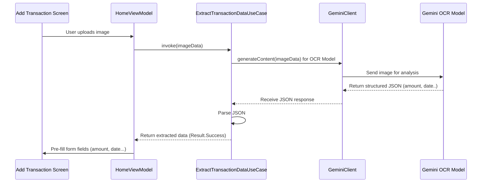
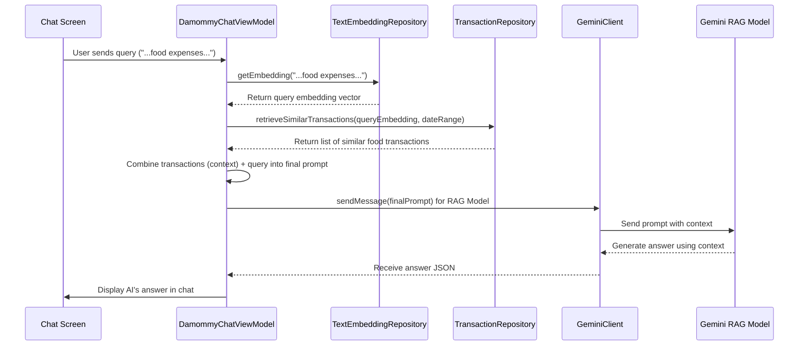

# Chapter 7: AI Integration (Gemini & Text Embedding)

Welcome back! In the [previous chapter](06_platform_specific_database_implementation__objectbox_room__.md), we explored how `Explained-Final` uses **ObjectBox** and **Room** to handle the actual saving and loading of data on Android and Desktop, respectively. We saw how the app adapts to different platforms while keeping the core logic consistent.

So far, we've focused on managing the data *you* enter. But `Explained-Final` has some "smart" features too! Imagine you take a picture of a receipt – wouldn't it be cool if the app could automatically fill in the amount and maybe even the category? Or what if you could ask the app questions about your spending in plain English, like "How much did I spend on coffee last month?" This is where Artificial Intelligence (AI) comes in.

## The Goal: Making the App Smarter

Manually entering every transaction detail can be tedious. And just looking at lists of numbers isn't always the most insightful way to understand your finances. We want to add intelligence to:

1.  **Automate Data Entry:** Use AI to read information from images (like receipts).
2.  **Enable Natural Language Interaction:** Allow users to chat with an AI assistant about their financial data.
3.  **Provide Smarter Insights:** Use AI to find relevant transactions when answering user questions.

This chapter explains how `Explained-Final` integrates AI, primarily using Google's **Gemini** models, to achieve these goals.

## Key Concepts: The AI Toolkit

Think of adding AI like adding a set of specialized power tools to our app:

1.  **Gemini Models:** These are powerful AI models provided by Google, each trained for specific tasks. In `Explained-Final`, we use different Gemini models like:
    *   An **OCR (Optical Character Recognition) model:** Trained to read text and structured data (like amount, date) from images (receipts).
    *   A **Summarization model:** Trained to create short titles for chat conversations.
    *   A **Financial Assistant model ("DaMommy"):** Trained to answer financial questions, understand context, and provide insights.

2.  **`GeminiClient`:** This is our app's "remote control" for talking to the different Gemini models. It knows how to send requests (like an image or a question) to the correct model and handle the response. It's configured with our API key (like a password to use Google's AI).

3.  **Text Embedding:** This is a fascinating AI technique. Imagine you could represent the *meaning* of a piece of text (like a transaction description: "Lunch with colleagues at cafe") as a list of numbers (a "vector"). Texts with similar meanings would have similar lists of numbers. This allows us to mathematically find text that is semantically similar.

4.  **`TextEmbeddingClient` / `TextEmbeddingRepository`:** These components handle the process of sending text to a specific Google AI model (`text-embedding-004`) and getting back the numerical vector (the embedding) that represents its meaning. The [Repository](02_data_persistence_abstraction__repositories__.md) provides a clean interface for the rest of the app to use this feature.

5.  **Retrieval-Augmented Generation (RAG):** This sounds complex, but the idea is simple. When you ask the "DaMommy" chat assistant a question (e.g., "What were my biggest shopping expenses?"), RAG helps provide a better answer.
    *   **Retrieval:** The app first uses text embeddings to find transactions in *your* database whose descriptions are most similar to your question.
    *   **Augmented Generation:** It then sends *both* your original question *and* the relevant transactions it found (the "context") to the Gemini chat model. The model uses this extra context to generate a more accurate and personalized answer based on your actual data.

6.  **`UseCases`:** As seen before, specific, self-contained actions, especially involving AI, are often wrapped in `UseCases` (like `ExtractTransactionDataUseCase`). This keeps the [ViewModels](03_viewmodels_.md) cleaner by hiding the details of interacting with the `GeminiClient`.

## Use Case 1: Scanning a Receipt (OCR)

Let's see how the app uses AI to read a receipt image.

1.  **User Action:** You take a photo of a receipt and upload it in the "Add Transaction" screen.
2.  **ViewModel:** The `HomeViewModel` receives the image data (as a `ByteArray`).
3.  **UseCase:** It calls the `ExtractTransactionDataUseCase`, passing the image data.
    ```kotlin
    // Simplified code in HomeViewModel.kt
    fun onUploadedImageChanged(byteArray: ByteArray) = viewModelScope.launch {
        // Show loading indicator
        _transactionToSubmitState.update { it.copy(isLoading = true) }

        // Call the UseCase to process the image
        when (val result = extractTransactionDataUseCase(byteArray)) {
            is Result.Success -> {
                // Update the form fields with extracted data
                _transactionToSubmitState.update {
                    it.copy(
                        amount = result.data.amount,
                        // ... update other fields ...
                        isLoading = false
                    )
                }
            }
            is Result.Error -> { /* Handle error */ }
        }
    }
    ```
4.  **Gemini Interaction (Inside UseCase):** The `ExtractTransactionDataUseCaseImpl` uses the `GeminiClient` to talk to the specialized `transactionOcrModel`.
    ```kotlin
    // Simplified code in ExtractTransactionDataUseCaseImpl.kt
    override suspend operator fun invoke(image: ByteArray): Result</*...*/> {
        val inputPhoto = content { // Prepare image for Gemini
            image(image)
            text("Extract this image") // Instruction
        }

        // Send image to the specific OCR model via GeminiClient
        val response = geminiClient.transactionOcrModel.generateContent(inputPhoto)

        try {
            // Parse the JSON response from Gemini
            val data = Json.decodeFromString</*...*/>(response.text!!)
            return Result.Success(data)
        } catch (e: Exception) { /* Handle error */ }
    }
    ```
5.  **Result:** The Gemini model analyzes the image and sends back structured data (JSON format) containing the amount, date, category guess, etc. The `UseCase` parses this and returns it to the `ViewModel`, which then pre-fills the transaction form fields.

Here's a simplified flow:



## Use Case 2: Chatting with DaMommy (RAG)

Now, let's see how the chat feature uses RAG and embeddings.

1.  **User Action:** You open the "DaMommy" chat screen and ask, "Show my biggest food expenses this month."
2.  **ViewModel:** The `DamommyChatViewModel` receives the query string.
3.  **Embedding the Query:** It uses the `TextEmbeddingRepository` to get the numerical vector for your query.
    ```kotlin
    // Simplified in DamommyChatViewModel.sendPrompt
    val userMessageText = /* User's query: "Show..." */

    // 1. Get embedding for the user's question
    val queryEmbeddingResult = textEmbeddingRepository.getEmbedding(userMessageText)
    ```
4.  **Retrieving Context:** If the query embedding was successful, the ViewModel asks the `TransactionRepository` to find transactions (within the selected date range) whose stored embeddings are *most similar* to the query's embedding. This uses vector similarity search in the database (handled differently by ObjectBox and Room).
    ```kotlin
    // Simplified in DamommyChatViewModel.sendPrompt
    val similarTransactions: List<Transaction> = if (queryEmbeddingResult is Result.Success) {
        // 2. Find similar transactions in DB using the query embedding
        transactionRepository.retrieveSimilarTransactions(
            queryEmbedding = queryEmbeddingResult.data.values,
            limit = /* How many to fetch? */,
            fromDate = /* Start date */,
            toDate = /* End date */
        )
    } else emptyList()
    ```
5.  **Augmenting the Prompt:** The ViewModel creates a new prompt for Gemini that includes *both* the relevant transactions it found *and* your original question.
    ```kotlin
    // Simplified in DamommyChatViewModel.sendPrompt
    val finalPrompt = if (similarTransactions.isEmpty()) {
        userMessageText // Just send the query if no context found
    } else {
        """
        Context:
        ${similarTransactions.joinToString("\n")}
        ------------------
        User Query: $userMessageText
        """ // Combine context and query
    }
    ```
6.  **Gemini Interaction:** It sends this combined `finalPrompt` to the `GeminiClient`'s `damommyRagModel`.
    ```kotlin
    // Simplified in DamommyChatViewModel.sendPrompt
    // 3. Send combined prompt (context + query) to the RAG model
    val response = chat.sendMessage(finalPrompt) // chat uses geminiClient.damommyRagModel

    // 4. Process Gemini's response (which considered the context)
    val data = Json.decodeFromString<DamomeResponse>(response.text!!)
    // ... update UI with data.message ...
    ```
7.  **Result:** The Gemini model uses the provided transaction context to generate a specific, data-driven answer (e.g., "Your biggest food expenses this month were $50 at Restaurant X and $35 at Grocery Store Y.") and sends it back. The ViewModel updates the chat UI.

Here's the RAG flow:



## Under the Hood: The `GeminiClient`

The `GeminiClient` acts as the central hub for configuring and accessing the different AI models.

```kotlin
// Simplified structure of GeminiClient.kt
// Found in: composeApp/.../data/remote/gemini/GeminiClient.kt
class GeminiClient {

    // Configure the OCR model
    val transactionOcrModel by lazy {
        GenerativeModel(
            modelName = "gemini-1.5-flash", // Which Gemini model to use
            apiKey = AppSecret.GEMINI_API_KEY, // Your secret key
            generationConfig = generationConfig { // Special settings
                responseMimeType = "application/json" // Ask for JSON output
            },
            systemInstruction = content { // Initial instructions for the AI
                text("You are an OCR system... extract amount, date...")
            }
        )
    }

    // Configure the RAG chat model
    val damommyRagModel by lazy {
        GenerativeModel(
            modelName = "gemini-1.5-flash",
            apiKey = AppSecret.GEMINI_API_KEY,
            // ... other config ...
            systemInstruction = content {
                text("You are DaMommy... use retrieved context... respond politely...")
            }
        )
    }

    // ... other models like chatSummaryModel, damommyModel (no RAG) ...
}
```

*   Each model (`transactionOcrModel`, `damommyRagModel`, etc.) is configured separately using `GenerativeModel`.
*   `modelName` specifies which version of Gemini to use.
*   `apiKey` authenticates our requests.
*   `generationConfig` allows setting parameters like the expected response format (`application/json`).
*   `systemInstruction` is crucial: it's the initial "prompt" or set of rules given to the AI to tell it how to behave and what its task is.

## Under the Hood: Text Embedding

Generating text embeddings involves calling a different Google API.

1.  **`TextEmbeddingClient`:** This uses Ktor (an HTTP client library) to send a POST request to the Google Generative Language API endpoint for embeddings.
    ```kotlin
    // Simplified structure of TextEmbeddingClient.kt
    // Found in: composeApp/.../text_embedding/api/TextEmbeddingClient.kt
    class TextEmbeddingClient(private val httpClient: HttpClient) {
        suspend fun fetchTextEmbedding(apiKey: String, text: String): Result</*...*/> {
            try {
                val response = httpClient.post( /* Google API URL */ ) {
                    parameter("key", apiKey) // API Key
                    contentType(ContentType.Application.Json)
                    // Body contains the text to embed and model name
                    setBody(TextEmbeddingRequest(text = text, /* ... */))
                }
                // Parse the response containing the embedding vector
                val embeddingResponse = response.body<TextEmbeddingResponse>()
                return Result.Success(embeddingResponse)
            } catch (e: Exception) { /* Handle errors */ }
        }
    }
    ```
2.  **`TextEmbeddingRepository`:** This repository provides a cleaner interface for the rest of the app, hiding the `TextEmbeddingClient` details.
    ```kotlin
    // Simplified TextEmbeddingRepositoryImpl.kt
    // Found in: composeApp/.../text_embedding/repository/TextEmbeddingRepositoryImpl.kt
    class TextEmbeddingRepositoryImpl(
        private val textEmbeddingClient: TextEmbeddingClient,
    ) : TextEmbeddingRepository {
        override suspend fun getEmbedding(text: String): Result<TextEmbedding> {
            // Call the client and map the result to our Domain Model
            return when (val response = textEmbeddingClient.fetchTextEmbedding(
                apiKey = AppSecret.GEMINI_API_KEY, text
            )) {
                is Result.Success -> Result.Success(response.data.toTextEmbedding())
                is Result.Error -> Result.Error(/*...*/)
            }
        }
    }
    ```
3.  **Saving Embeddings:** When a new transaction is saved (in `HomeViewModel`), if it has a description, the app generates `textToEmbed` (a formatted string including type, amount, category, and description) and calls `textEmbeddingRepository.getEmbedding` to get its vector. This vector is then saved along with the transaction data in the database (handled by the [Platform-Specific Database Implementation](06_platform_specific_database_implementation__objectbox_room__.md)). This allows for later similarity searches.

## Conclusion

You've now learned how `Explained-Final` incorporates AI to provide smarter features:

*   It uses **Google Gemini models** for tasks like OCR, summarization, and financial chat assistance.
*   A **`GeminiClient`** manages communication with these different models.
*   **Text Embedding** converts transaction descriptions into numerical vectors for similarity searches.
*   A **`TextEmbeddingClient`** and **`TextEmbeddingRepository`** handle the process of getting these embeddings.
*   **Retrieval-Augmented Generation (RAG)** enhances the "DaMommy" chatbot by retrieving relevant user transactions (using embeddings) to provide context-aware answers.
*   **`UseCases`** often encapsulate specific AI tasks (like OCR) for cleaner integration.

These AI components add significant value by automating data entry and enabling more intuitive interaction with financial data.

But how do all these different pieces – ViewModels, Repositories, Clients, UseCases, Database Stores – get created and connected? How does the `HomeViewModel` get an instance of the `TransactionRepository` and `ExtractTransactionDataUseCase`? This is managed by a Dependency Injection framework.

Let's move on to the final chapter to see how it all ties together: [Chapter 8: Koin Dependency Injection Setup](08_koin_dependency_injection_setup_.md).

---

Generated by [AI Codebase Knowledge Builder](https://github.com/The-Pocket/Tutorial-Codebase-Knowledge)