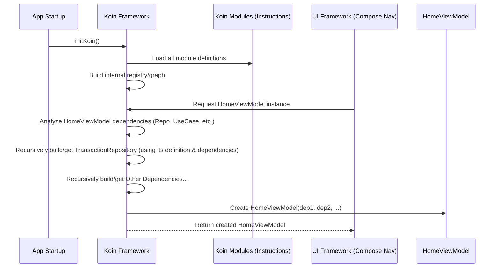

# Chapter 8: Koin Dependency Injection Setup

Welcome to the final chapter! In the [previous chapter](07_ai_integration__gemini___text_embedding__.md), we saw how the app integrates AI using tools like the `GeminiClient` and `TextEmbeddingRepository` to add smart features. We've now explored all the major building blocks: [Domain Models](01_domain_models_.md), [Repositories](02_data_persistence_abstraction__repositories__.md), [ViewModels](03_viewmodels_.md), [Navigation](04_navigation_system__routes___navgraph__.md), [Database Entities](05_database_entities_.md), [Platform-Specific DB](06_platform_specific_database_implementation__objectbox_room__.md), and [AI Integration](07_ai_integration__gemini___text_embedding__.md).

But how do all these pieces actually get *connected*? For example, how does the `HomeViewModel` get the specific `TransactionRepository` it needs to talk to? How does the `TransactionRepository` get the correct `TransactionLocalStore` (the ObjectBox version on Android, the Room version on Desktop)? Manually creating and passing all these objects around would be incredibly messy!

## The Problem: Tangled Wires

Imagine building a complex electronic device like a computer. You have the CPU, the RAM, the hard drive, the graphics card, etc. If you had to manually connect every single wire between every component yourself, it would be a nightmare! You'd have wires everywhere, it would be hard to add new components, and fixing a connection would be very difficult.

Our app faces a similar challenge. Look at our `HomeViewModel`:

```kotlin
// HomeViewModel needs several dependencies
class HomeViewModel(
    private val transactionRepository: TransactionRepository, // Needs this
    private val currencyRepository: CurrencyRepository,     // Needs this
    private val textEmbeddingRepository: TextEmbeddingRepository, // Needs this
    private val extractTransactionDataUseCase: ExtractTransactionDataUseCase, // Needs this
    private val dispatcher: CoroutineDispatcher          // Needs this too!
) : ViewModel() {
    // ... view model logic ...
}
```

To create just *one* `HomeViewModel`, we'd first need to create:
*   A `TransactionRepository`, which itself needs a `TransactionLocalStore` and a function to create `TransactionObject`s.
*   A `CurrencyRepository`, which needs its own `LocalStore` and `Object` creator.
*   A `TextEmbeddingRepository`, which needs a `TextEmbeddingClient`.
*   An `ExtractTransactionDataUseCase`, which needs a `GeminiClient`.
*   A `CoroutineDispatcher`...

And each of *those* dependencies might have *their own* dependencies! Creating everything manually would look like this:

```kotlin
// DON'T DO THIS! Manual dependency creation is messy!
fun createHomeViewModelManually(): HomeViewModel {
    // Create low-level dependencies first
    val httpClient = HttpClient { /* ... config ... */ }
    val textEmbeddingClient = TextEmbeddingClient(httpClient)
    val geminiClient = GeminiClient()
    // Assume we created the correct DB stores (TransactionLocalStore, etc.)
    val transactionLocalStore = createCorrectTransactionLocalStore() // Complex!
    val currencyLocalStore = createCorrectCurrencyLocalStore()       // Complex!
    val transactionObjectCreator = { /* ... lambda ... */ }
    val currencyObjectCreator = { /* ... lambda ... */ }
    val dispatcher = Dispatchers.Default

    // Create mid-level dependencies
    val transactionRepository = TransactionRepositoryImpl(
        transactionLocalStore, transactionObjectCreator
    )
    val currencyRepository = CurrencyRepositoryImpl(
        currencyLocalStore, currencyObjectCreator
    )
    val textEmbeddingRepository = TextEmbeddingRepositoryImpl(textEmbeddingClient)
    val extractUseCase = ExtractTransactionDataUseCaseImpl(geminiClient)

    // Finally, create the ViewModel
    return HomeViewModel(
        transactionRepository,
        currencyRepository,
        textEmbeddingRepository,
        extractUseCase,
        dispatcher
    )
}
```

This is complicated, error-prone, and makes the code very rigid (tightly coupled). If `TransactionRepositoryImpl`'s constructor changes, we have to find and update every place it's created manually. There must be a better way!

## The Solution: Dependency Injection (DI) with Koin

**Dependency Injection** is like having an expert assembly line manager for your app's components. Instead of you manually connecting all the wires, you just tell the manager: "I need a `HomeViewModel`". The manager already knows how to build a `HomeViewModel` and *all* its required parts (its dependencies) and just hands you the finished product.

**Koin** is the specific DI framework (the "manager") used in `Explained-Final`. It's a lightweight, easy-to-use library for Kotlin.

Think of Koin as a central **Registry** or **Factory**. You teach Koin *how* to create each component of your app once, and then whenever any part of your app needs a component, it just asks Koin for it.

## Key Concepts: Teaching Koin How to Build

1.  **Modules (The Instruction Manuals):**
    Modules are where you define the "recipes" or "blueprints" for creating your objects. You group related definitions together. `Explained-Final` has several modules:
    *   `viewModelModule`: Knows how to create all the [ViewModels](03_viewmodels_.md).
    *   `repositoryModule` & `sharedRepositoryModule`: Know how to create [Repositories](02_data_persistence_abstraction__repositories__.md) and the `TextEmbeddingRepository`.
    *   `databaseModule`: Knows how to create the platform-specific database components ([Platform-Specific Database Implementation (ObjectBox/Room)](06_platform_specific_database_implementation__objectbox_room__.md)).
    *   `httpClientModule`: Knows how to create network clients (`HttpClient`, `TextEmbeddingClient`, `GeminiClient`).
    *   `useCaseModule`: Knows how to create specific [AI Integration](07_ai_integration__gemini___text_embedding__.md) use cases.

2.  **Definitions (`single`, `viewModelOf`, `get()`):**
    Inside a module, you use keywords to tell Koin *how* to provide an object:
    *   **`single { ... }`**: This tells Koin to create the object *only once* (a singleton) and reuse that same instance every time someone asks for it. Good for things like Repositories or Clients that don't need multiple copies.
    *   **`viewModelOf(::ClassName)`**: A shortcut specifically for creating [ViewModels](03_viewmodels_.md). It tells Koin: "To create this ViewModel, find its constructor (like `::HomeViewModel`), figure out what dependencies *it* needs, `get()` those dependencies, and then call the constructor."
    *   **`get()`**: This is used *inside* a definition. It tells Koin: "To build the current object, I need an instance of *another* object. Please find or build that other object and give it to me."

    Let's look at simplified examples:

    ```kotlin
    // Simplified viewModelModule
    // File: composeApp/.../di/ViewModelModule.kt
    val viewModelModule = module {
        // Tell Koin how to build HomeViewModel
        viewModelOf(::HomeViewModel)
        // Tell Koin how to build RecordsViewModel
        viewModelOf(::RecordsViewModel)
        // ... other ViewModels ...
    }
    ```
    This tells Koin: "When someone asks for a `HomeViewModel`, use its constructor (`::HomeViewModel`). Figure out what it needs (like `TransactionRepository`) and `get()` them."

    ```kotlin
    // Simplified sharedRepositoryModule (Desktop example)
    // File: composeApp/.../di/RepositoryModule.desktop.kt
    actual val sharedRepositoryModule = module {
        // Tell Koin how to build ONE instance of TransactionRepository
        single<TransactionRepository> {
            TransactionRepositoryImpl(
                transactionLocalStore = get(), // Ask Koin for TransactionLocalStore
                entityDataSource = get(named("TransactionObject")) // Ask Koin for specific named function
            )
        }
        // ... other Repositories ...
    }
    ```
    This tells Koin: "Create a *single* instance of `TransactionRepository`. To do that, create a `TransactionRepositoryImpl`. That implementation needs a `transactionLocalStore` – go `get()` one! It also needs an `entityDataSource` function – go `get()` the one we named 'TransactionObject'."

3.  **`initKoin` (Starting the Factory):**
    This function is called when the app starts (in `MyApplication` on Android, `main` on Desktop, `MainViewController` on iOS). It tells Koin to load all the instruction manuals (modules) and get ready to build things.

    ```kotlin
    // File: composeApp/.../di/initKoin.kt
    fun initKoin(config: KoinAppDeclaration? = null) {
        startKoin {
            config?.invoke(this) // Platform-specific setup (like Android context)
            modules( // Load all the instruction manuals
                httpClientModule,
                databaseModule, // Platform-specific!
                repositoryModule,
                sharedRepositoryModule, // Platform-specific!
                viewModelModule,
                useCaseModule
            )
        }
    }
    ```
    This collects all the modules and starts the Koin application context.

## How It Works: Getting a `HomeViewModel`

Now, when the app needs a `HomeViewModel` (e.g., when navigating to the Home screen using Compose Navigation's Koin integration):

1.  **Request:** The framework asks Koin for a `HomeViewModel`.
2.  **Lookup:** Koin looks in its registry (built from the modules during `initKoin`). It finds the `viewModelOf(::HomeViewModel)` definition.
3.  **Dependency Analysis:** Koin examines the `HomeViewModel` constructor: `(TransactionRepository, CurrencyRepository, TextEmbeddingRepository, ExtractTransactionDataUseCase, CoroutineDispatcher)`. It sees it needs these five dependencies.
4.  **Recursive Build/Get:**
    *   Koin looks for `TransactionRepository`. It finds the `single { TransactionRepositoryImpl(...) }` definition.
    *   To build `TransactionRepositoryImpl`, Koin sees it needs `TransactionLocalStore`. Koin looks for `TransactionLocalStore`.
    *   Koin finds the correct *platform-specific* `single { TransactionLocalStoreAndroid(...) }` or `single { TransactionLocalStoreDesktop(...) }` definition (thanks to `expect`/`actual` `databaseModule`). Koin builds/gets the `LocalStore`.
    *   Koin finds the `entityDataSource` function.
    *   Koin now has the parts for `TransactionRepositoryImpl`, so it builds it (and stores it, because it's a `single`).
    *   Koin repeats this process for `CurrencyRepository`, `TextEmbeddingRepository`, `ExtractTransactionDataUseCase`, and the `Dispatcher`. It builds or gets each one, resolving *their* dependencies recursively.
5.  **Final Assembly:** Once Koin has obtained instances of all five dependencies, it calls the `HomeViewModel` constructor with those instances.
6.  **Return:** Koin returns the fully formed `HomeViewModel` object, ready to use.

All that complex creation logic we saw earlier is now handled automatically by Koin!



## Platform-Specific Magic (`expect`/`actual`)

How does Koin know whether to use `TransactionLocalStoreAndroid` (ObjectBox) or `TransactionLocalStoreDesktop` (Room)?

Remember the `expect`/`actual` pattern from [Chapter 6](06_platform_specific_database_implementation__objectbox_room__.md)? We use it for the modules too!

**1. `commonMain` defines the expectation:**

```kotlin
// File: composeApp/src/commonMain/kotlin/com/harissabil/damome/di/DatabaseModule.kt
package com.harissabil.damome.di

import org.koin.core.module.Module

// Expects each platform to provide its own database module definition
expect val databaseModule: Module
```

**2. `androidMain` provides the Android implementation:**

```kotlin
// File: composeApp/src/androidMain/kotlin/com/harissabil/damome/di/DatabaseModule.android.kt
package com.harissabil.damome.di
// ... imports ...
import com.harissabil.damome.data.local.object_box.TransactionLocalStoreAndroid // Android version

actual val databaseModule = module {
    // TransactionLocalStore definition for Android
    single { // Create ONE instance
        TransactionLocalStoreAndroid( // Use the ObjectBox implementation
            entityClass = TransactionEntity::class,
            // ... other ObjectBox specific params ...
        )
    }
    // ... other Android database definitions ...
}
```

**3. `desktopMain` provides the Desktop implementation:**

```kotlin
// File: composeApp/src/desktopMain/kotlin/com/harissabil/damome/di/DatabaseModule.desktop.kt
package com.harissabil.damome.di
// ... imports ...
import com.harissabil.damome.data.local.local_store.TransactionLocalStoreDesktop // Desktop version

actual val databaseModule = module {
    // TransactionLocalStore definition for Desktop
    single { // Create ONE instance
        TransactionLocalStoreDesktop( // Use the Room implementation
            transactionDao = get() // Ask Koin for the Room TransactionDao
        )
    }
    // ... other Desktop database definitions (including the Dao) ...
}
```

When `initKoin` runs, it includes `databaseModule`. Because of the `expect`/`actual` mechanism, Koin automatically loads the correct platform-specific version (`.android.kt` or `.desktop.kt`). So, when `TransactionRepositoryImpl` later asks Koin for a `TransactionLocalStore` using `get()`, Koin provides the instance defined in the module for the platform the app is currently running on!

The same pattern is used for `sharedRepositoryModule` because the `TransactionRepositoryImpl` needs the correct platform's `TransactionLocalStore`.

## Why Use Koin (Dependency Injection)?

*   **Decoupling:** Classes like `HomeViewModel` don't need to know *how* to create their dependencies (like `TransactionRepository`). They just declare what they need. This makes code easier to change.
*   **Testability:** When testing `HomeViewModel`, you can easily tell Koin to provide *fake* or mock versions of its dependencies (like a fake `TransactionRepository` that uses an in-memory list instead of a real database).
*   **Organization:** Modules provide a central place to declare how objects are created, making the app's setup clear and manageable.
*   **Lifecycle Management:** Koin can manage the lifecycle of objects (e.g., `single` ensures only one instance). `viewModelOf` integrates with platform lifecycle management.
*   **Readability:** Constructors become cleaner, showing *what* a class needs, not *how* to build those needs.

## Conclusion

You've reached the end of the `Explained-Final` tutorial! In this chapter, we learned about **Koin Dependency Injection**.

*   DI solves the problem of manually creating and connecting ("wiring") the different components of the app.
*   **Koin** acts as a central **Registry** or **Factory** that knows how to build objects.
*   **Modules** (`viewModelModule`, `databaseModule`, etc.) contain the "instructions" (`single`, `viewModelOf`) telling Koin how to create specific objects.
*   **`initKoin`** starts the Koin system, loading all the modules.
*   Classes request their dependencies from Koin using **`get()`** (often implicitly via constructors).
*   Koin uses the `expect`/`actual` pattern for modules like `databaseModule` and `sharedRepositoryModule` to provide the correct **platform-specific** implementations (e.g., ObjectBox vs. Room components).
*   Using Koin makes the app more **organized, decoupled, testable, and maintainable**.

We've journeyed from the basic data blueprints ([Domain Models](01_domain_models_.md)) all the way through data storage ([Repositories](02_data_persistence_abstraction__repositories__.md), [Entities](05_database_entities_.md), [DB Implementations](06_platform_specific_database_implementation__objectbox_room__.md)), screen management ([ViewModels](03_viewmodels_.md)), navigation ([Navigation System](04_navigation_system__routes___navgraph__.md)), AI features ([AI Integration](07_ai_integration__gemini___text_embedding__.md)), and finally, how it's all connected ([Koin DI](08_koin_dependency_injection_setup_.md)).

Hopefully, this breakdown gives you a solid understanding of the core architectural concepts used in `Explained-Final`. Happy coding!

---

Generated by [AI Codebase Knowledge Builder](https://github.com/The-Pocket/Tutorial-Codebase-Knowledge)