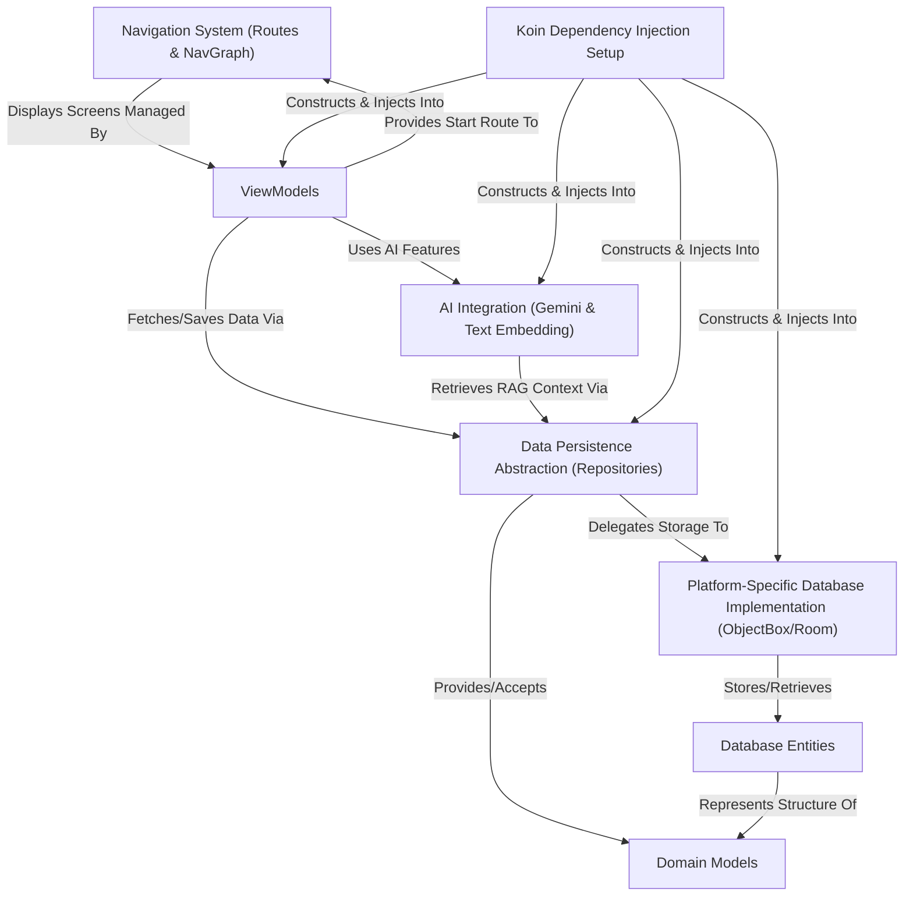

# Tutorial: Explained-Final

This project is a *multiplatform* personal finance manager application (running on Android and Desktop).
It helps users track their **income** and **expenses**, manage transaction *categories*, and view their financial history.
The app includes **AI features** like extracting transaction details from images (OCR) and a conversational financial assistant named "DaMommy" that can provide insights based on user data using *Retrieval-Augmented Generation (RAG)*.

**Source Repository:** [https://github.com/harissabil/DaMoMe](https://github.com/harissabil/DaMoMe)

## Chapters

1. [Domain Models
](01_domain_models_.md)
2. [Data Persistence Abstraction (Repositories)
](02_data_persistence_abstraction__repositories__.md)
3. [ViewModels
](03_viewmodels_.md)
4. [Navigation System (Routes & NavGraph)
](04_navigation_system__routes___navgraph__.md)
5. [Database Entities
](05_database_entities_.md)
6. [Platform-Specific Database Implementation (ObjectBox/Room)
](06_platform_specific_database_implementation__objectbox_room__.md)
7. [AI Integration (Gemini & Text Embedding)
](07_ai_integration__gemini___text_embedding__.md)
8. [Koin Dependency Injection Setup
](08_koin_dependency_injection_setup_.md)

---

Generated by [AI Codebase Knowledge Builder](https://github.com/The-Pocket/Tutorial-Codebase-Knowledge)